<!-- Intro -->

Ormai sono anni che Audio HackLab sperimenta con i piezo utilizzandoli come microfoni a contatto. Uno dei modi più efficaci di utilizzarli è pinzarli alle superfici, ecco perchè abbiamo unito un disco piezo, una pinza e un jack. 

Abbiamo documentato il tutto step by step.

### Step 1: Lista dei materiali

 Ecco la lista dei materiali che abbiamo usato:

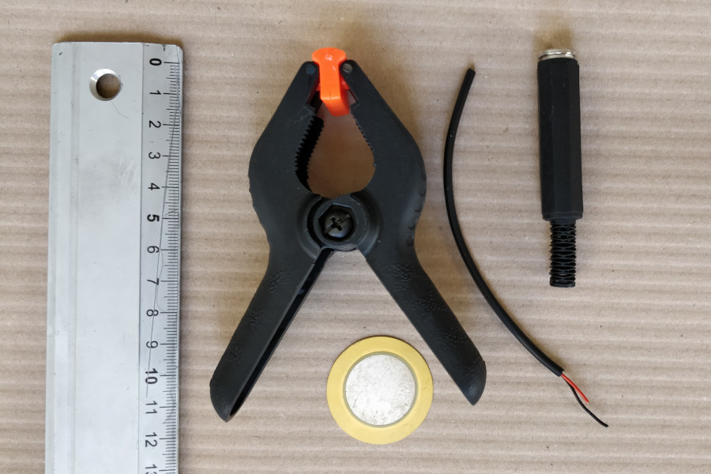

- Pinza in plastica con punta a morsetti basculanti
- Trasduttore piezoelettrico (aka piezo buzzer)
- Presa jack femmina mono volante, da ¼ di pollice (6,3mm)
- 15 cm circa (dipende dalle dimensioni della pinza) di cavo microfonico schermato

Inoltre abbiamo utilizzato i seguenti strumenti:
- saldatore e stagno
- terza mano
- taglierino
- forbici
- colla epossidica bi-componente (al suo posto si può anche usare la colla a caldo, ma dura sicuramente meno sul lungo periodo)

### Step 2: Modifica del jack e della pinza

Abbiamo estratto il jack dalla sua guaina e tagliala di una misura adatta al manico della pinza.

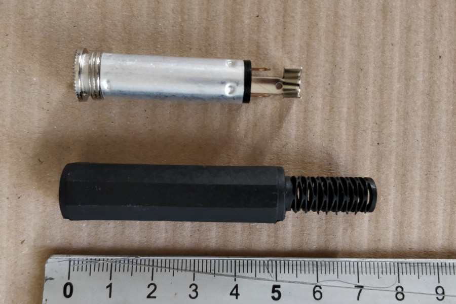

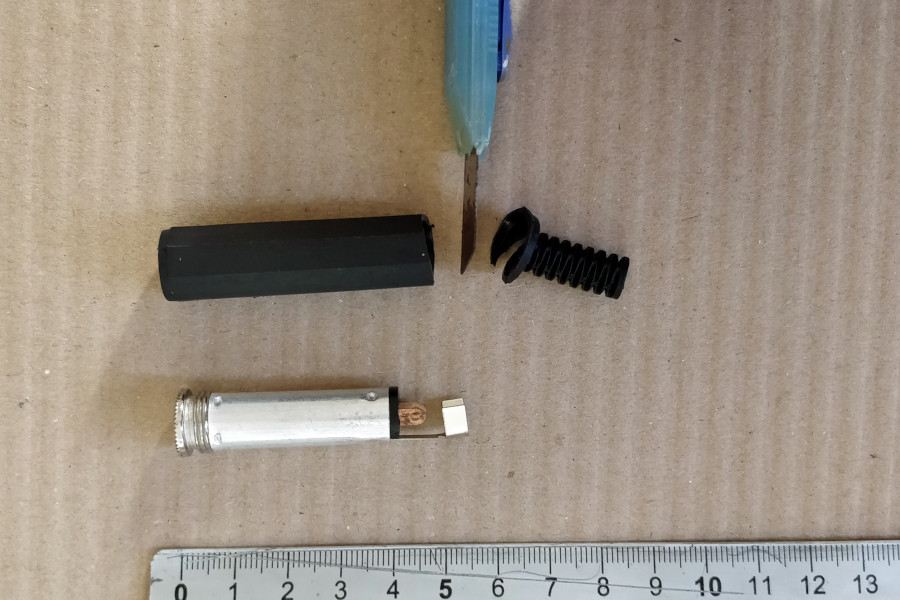

Per far spazio alla guaina del jack abbiamo rifilato il bordo della pinza con un taglierino per rimuovere la parte tonda.

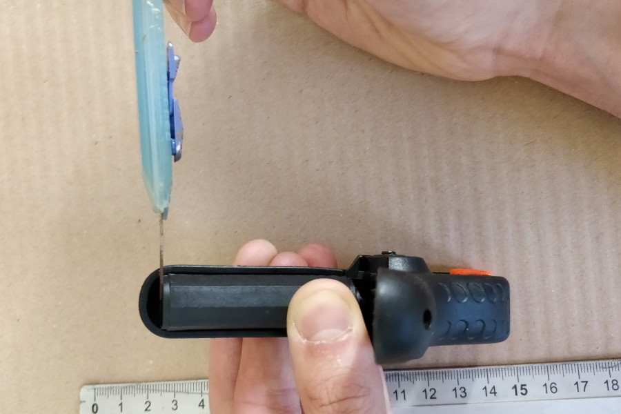

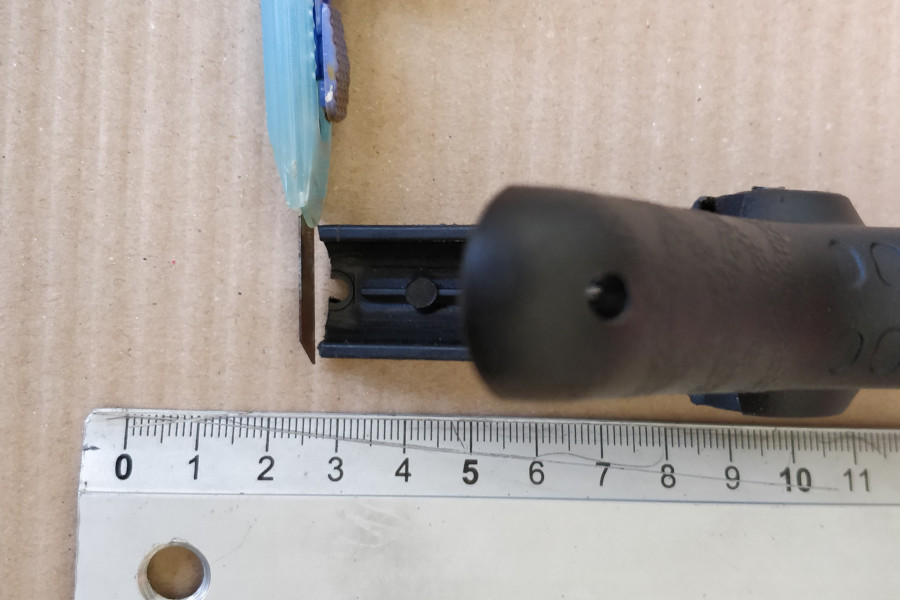

### Step 3: Incollaggio jack/pinza

Con la colla epossidica abbiamo cosparso  l’interno del manico della pinza e un lato della guaina per incollarle tra loro: ovviamnete la filettatura va verso l’esterno della pinza.

### Step 4: Preparazione del jack e del cavo

Dopo aver spellato circa un centimetro di guaina abbiamo intracciato calza con il filo nero e il filo rosso su se stesso.
Con la punta ben pulita del saldatore li abbiamo stagnati per facilitare il passaggio successivo.   

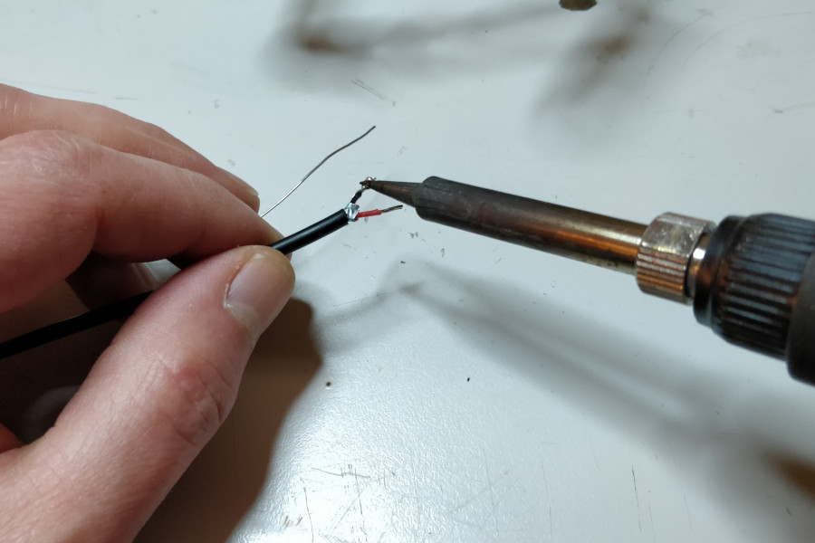

Stessa cosa con i termimali del jack.

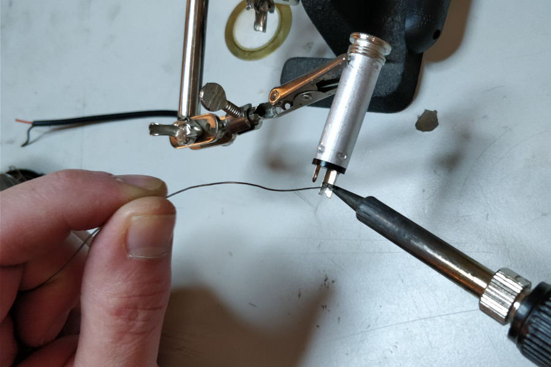

### Step 5: Saldatura del jack con il cavo

Il filamento nero con la calza l'abbiamo saldato alla massa del jack (ground) ed il filamento rosso al polo left ovvero la punta del jack o “tip”. Nel nostro jack il terminale più largo è la massa. Ma questo può variare.

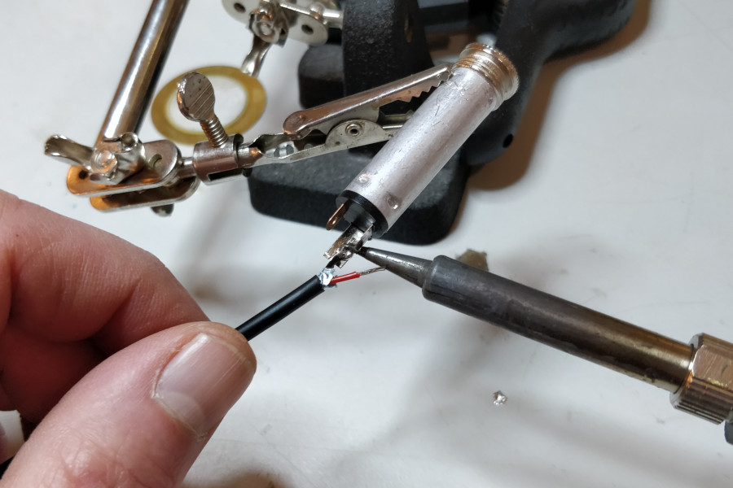

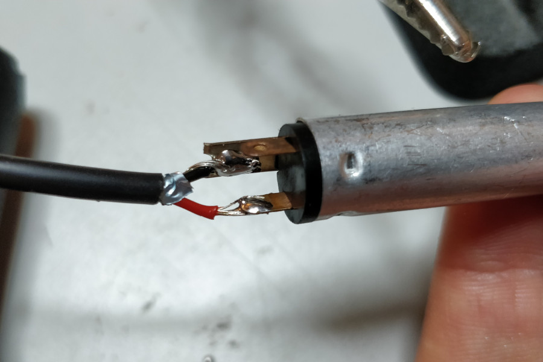

Tips: se lo stai facendo anche tu consulta il datasheet del tuo jack per capire a cosa corrispondono i terminali oppure aiutati con un tester che abbia il controllo di continuità: inserisci un jack maschio e verifica a quale dei due poli della femmina sono collegati la punta del cavo e la base del cavo (gnd). Non hai un tester? Usa una pila ed un led!

### Step 6: Inserimento del jack

Per inserire il jack abbiamo prima infilato il cavo nella guaina facendolo passare sotto la molla e poi avvitato.

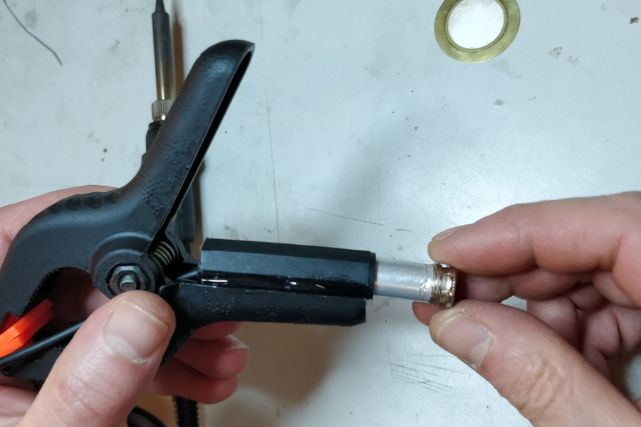

### Step 7: Saldatura del piezo

Tagliato il cavo della giusta misura abbiamo prima saldato il terminale rosso alla parte ceramica del piezo (quella centrale bianca) e poi il terminale nero al bordo in ottone, questa volta senza calza metallica altrimenti la schermatura non avrebbe effetto.

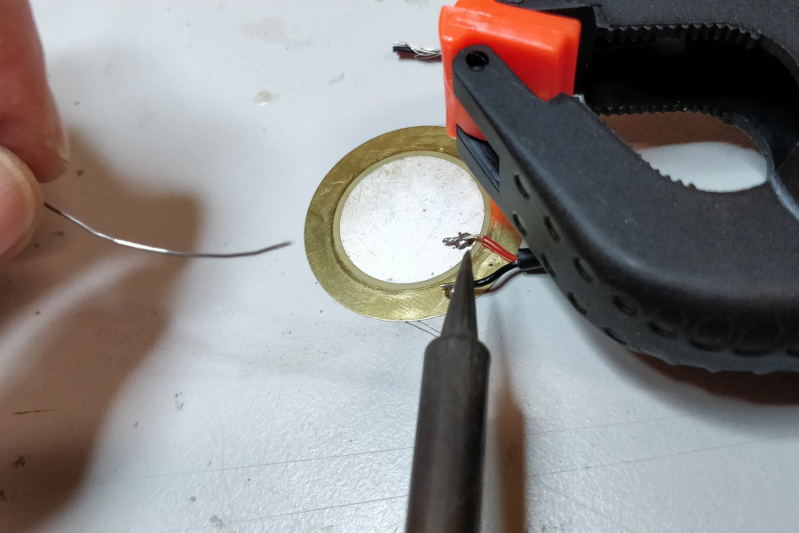

La parte in ceramica è molto delicata, quindi se vuoi saldarti anche tu un piezo usa temperature il più basse possibili per il sadatore e tenta di metterci meno tempo possibile. E salda abbastanza vicino al bordo per facilitare il prossimo passaggio.

### Step 8: Incollaggio del piezo

Con un altro po’ di miscela di colla abbiamo cosparso delicatamente il piezo in modo da ricoprire tutto il lato della saldatura.

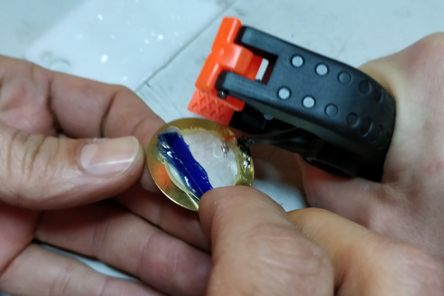

Tenendo la pinza aperta abbiamo posizionato il piezo facendo attenzione a mantenere i punti di saldatura verso l’interno della pinza e a non incastrarli tra il piezo e la punta della pinza stessa.     

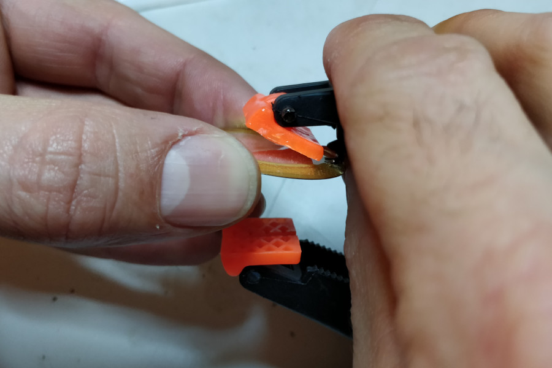

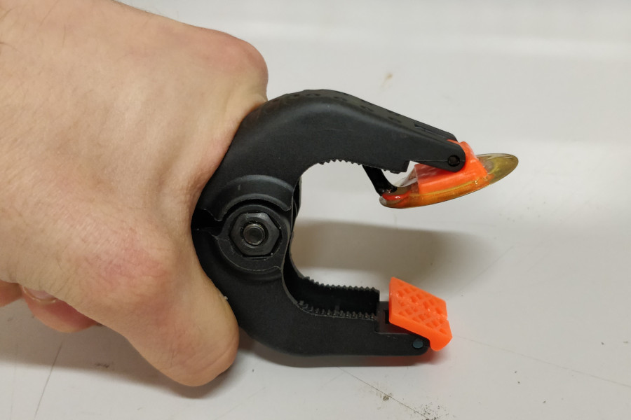

Dopo aver chiuso la pinza facendo attenzione a non spostare il piezo abbiamo utilizzato il residuo di colla per rifinire e consolidare il tutto.

### Step 9: Collaudo!

A colla asciutta siamo passati al collaudo. Il jack alla pinza si usa come un normale microfono e l'abbiamo collegato ad un ampli: ora siam pronti per ascoltare suoni inediti!

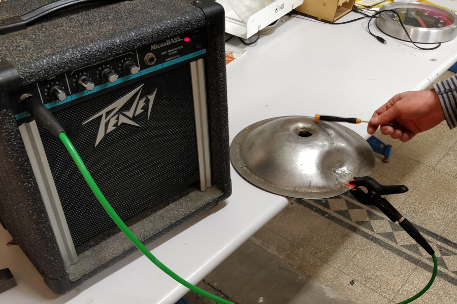

Noi l'abbiamo provato pinzando oggetti metallici vari: reti, molle, corde, ringhiere, etc.; ma anche tavoli e strumenti musicali. Abbiamo anche aggiunto un delay luuuungo per un risultato straordinario!   

Per qualsiasi dubbio, per farci vedere la tua nuova pinza o farci ascoltare i suoni che hai registrato, scrivici a: info@audiohacklab.org

Autori: _Andrea Reali_, _Francesco Pasino_, _Tito Castelli_

<!--more-->
